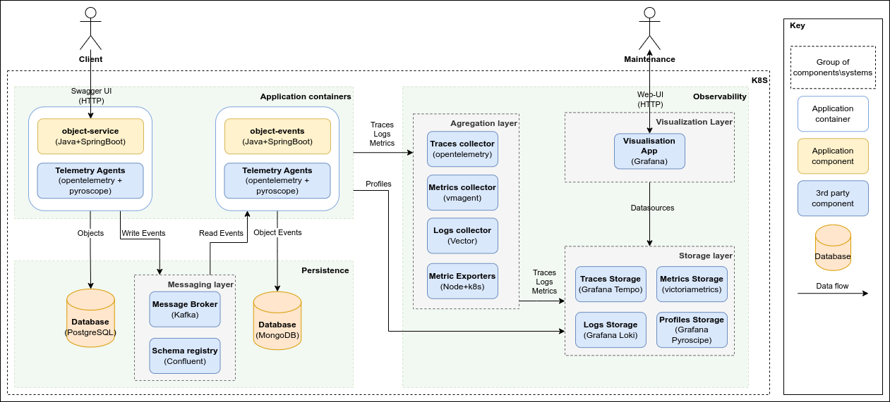

= Sandbox project

Sandbox project with java microservices to be used for educational or project accelerator purposes

== Modules

- **object-api** - contains services specifications and UML flow diagrams
- **object-service** - simple service for object CRUD operations and filtering
- **object-events** - simple service for storing object events

== Solution structure

For more documentation link:docs/diagrams.adoc[docs]

== Technologies\frameworks used:

=== Specification

- OpenApi 3
- Avro

=== Development

* Java 21
* Frameworks
** Spring Boot 3.5
** Spring Data
** Spring Kafka
** Spring Metrics
** Lombok
** MapStruct
** Liquibase
** Micrometer
** Springdoc
* Maven
* Postgresql
* MongoDB
* Kafka
* Schema registry

=== Deployment

* Docker
* Kubernetes
* Helm

=== Observability

* OpenTelemetry + OTEL Collector (Community)
* Victoriametrics
* Grafana Tempo
* Grafana Loki
* Grafana Pyroscope
* Vector
* Clickhouse (Traces)

== Deployment instructions

=== Pre-requirements
* Docker
* Minikube or other K8S cluster
* Helm
* Kubectl
* Maven 3+
* JDK 21+

=== Minikube environment

NOTE: **Important**. Minikube specifics in bash scripts is only used for pushing application images inside Kubernetes. Env\Obs scripts can be used with any other Kubernetes deployment

==== Setup

link:deploy/readme.adoc[Deployment instructions]

== Usage

Project doesn't provide any Ingresses or NodePorts as it's very env-specific so any of deployed apps can be accessed via https://kubernetes.io/docs/tasks/access-application-cluster/port-forward-access-application-cluster/[K8S Port Forwarding]

== Swagger UI

Swagger UI is available for object-service on http://localhost:8080[]

=== Env credentials:

* Postgres (admin:password)
* MongoDB (admin:password)
* Grafana  (admin:password)
* Clickhouse (admin:password)

