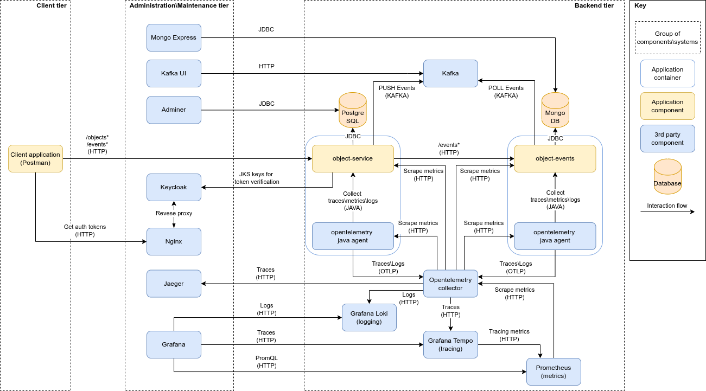

# Sandbox project

Sandbox project with java microservices to be used for educational or project accelerator purposes  
Simplified data flow is described at [flow diagram](./object-api/src/main/resources/flows/object-modify.puml)


## Modules

- **object-api** - contains services specifications and UML flow diagrams
- **object-service** - simple service for object CRUD operations and filtering
- **object-events** - simple service for storing object events

## Architecture


## Technologies\frameworks used:

### Specification

- OpenApi 3
- AsyncApi 2.3
- JSON Schema
- Avro
- PlantUml

### Development

- Java
- Frameworks
    - Spring
    - Spring Boot
    - Spring Data
    - Spring Kafka
    - Spring Metrics
    - Spring security (Resource server)
    - Lombok
    - MapStruct
    - Liquibase
    - Micrometer
    - Springdoc
- Maven
- Postgresql
- MongoDB
- Kafka + Schema registry
- Keycloak
- Nginx

### Deployment

- Docker
- Kubernetes

### Tracing/Monitoring/Logging

- OpenTelemetry + OTEL Collector + Custom agent extension for sampling
- Jaeger
- Prometheus
- Grafana + Tempo + Loki
- Vector

## Deployment instructions

### Pre-requirements
 - Docker or Minikube
 - Maven
 - JDK 17+

### Docker environment

- Run ```mvn clean install``` to build project artifacts
- Use ```build-docker-images.sh``` to build all utility images 
- Use ```./docker/docker-env-start.sh``` to setup project environment and ```./docker/docker-env-stop.sh``` to clean it.
  In case persistent data needs to be removed use ```docker-env-full-cleanup.sh```
- After environment is initialized use ```./docker/docker-app-start.sh``` to start services
  and ```./docker/docker-app-stop.sh``` to stop them.

#### Endpoints by default available at:

- REST endpoints - http://localhost:8080
- Postgres adminer - http://localhost:8088 (admin:password)
- Kafka UI - http://localhost:8092
- MongoDB Express - http://localhost:8085 (admin:password)
- Jaeger - http://localhost:16686
- Prometheus - http://localhost:9090
- Grafana - http://localhost:3000 (admin:password)
- Keycloak http://keycloak:8083 (admin:password)

### Minikube environment

> **Important**. Minikube specifics is only used for pushing application images inside Kubernetes. Environment scripts
> can be used with any other Kubernetes deployment

- Run ```mvn clean install``` to build project artifacts
- Ensure minikube is running. Use ```minikube dashboard``` to access web UI
- Use ```kubernetes-build-env-images.sh``` to build all utility images
- Use ```./kubernetes/kubernetes-env-start.sh``` to setup project environment
  and ```./kubernetes/kubernetes-env-stop.sh``` to clean it. In case persistent data needs to be removed
  use ```kubernetes-env-full-cleanup.sh```
- After environment is initialized use ```./kubernetes/kubernetes-app-start.sh``` to start services
  and ```./kubernetes/kubernetes-app-stop.sh``` to stop them.
- Use ```minikube tunnel``` to expose services to local machine